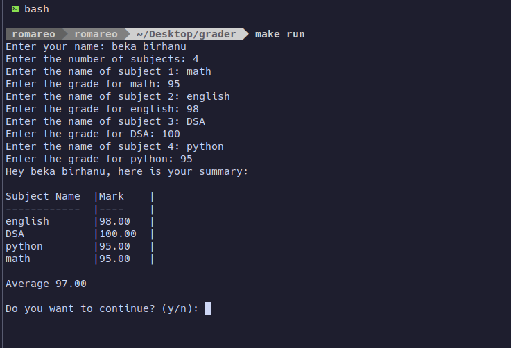

# Grader Application

## Overview

The Grader Application is a service designed to manage subjects and grades. It provides functionalities to add new subjects with their respective marks and compute the average marks for subjects owned by a specific user.

## Features

- Add a new subject with a name and mark.
- Retrieve a list of subjects by owner.
- Compute the average mark for subjects owned by a user.

## Getting Started

### Prerequisites

- Go (1.18 or later) installed on your machine.
- Go modules enabled.

## Installation

To get started with the Grader application, follow these steps:

1. **Clone the repository:**

```sh
   git clone https://github.com/beka-birhanu/grader.git
```

2. **Navigate into the project directory:**

```sh
   cd grader
```

3. **Build the application:**

```sh
  make build
```

This command compiles the code and outputs the executable to `bin/grader`.

## Usage

After building the application, you can run it using:

```sh
make run
```

### Directory Structure

- `cmd/` - Main application entry point.
- `model/` - Contains domain models and validation logic.
- `gradesrvs/` - Implements the core business logic for managing grades.
- `common/` - Contains shared interfaces and types.
- `infrastructure/` - Provides concrete implementations of interfaces like repositories.


